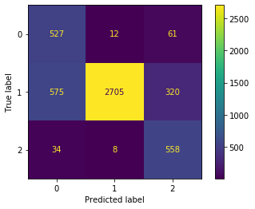

### TASK 2: DISEASE CLASSIFICATION FROM IMAGE FEATURES

This task is primarily concerned with multi-class classification where you have 3 classes. However, we have changed the original image features in several ways. You will need to deal with class imbalance; in the training set, there are 600 examples from class 0 and 2 but 3600 examples from class 1. Test set has the same class imbalance as the training set.


```python
import math
import time
import random
import sys
import os
import pandas as pd
import numpy as np
from matplotlib import pyplot as plt

import sklearn
from sklearn import svm
from sklearn.metrics import balanced_accuracy_score
from sklearn.metrics import plot_confusion_matrix
from sklearn.preprocessing import StandardScaler
from sklearn.preprocessing import MinMaxScaler
from sklearn.feature_selection import SelectKBest
from sklearn.feature_selection import f_classif
from sklearn.feature_selection import chi2
from sklearn.model_selection import StratifiedKFold
from sklearn.model_selection import GridSearchCV
from sklearn.model_selection import RandomizedSearchCV
```


```python
X_train = pd.read_csv('./data/X_train.csv')
y_train = pd.read_csv('./data/y_train.csv')
X_train['y'] = y_train['y']
raw_df = X_train.drop(['id'], axis=1)
```


```python
df = raw_df.copy()
all_labels = np.array(df.loc[:, 'y'])

# extract labels
y = np.array(df.pop('y'))

# extract features
X = np.array(df)
```

### Explore the data and class label imbalance

Let's look at the dataset imbalance:


```python
cls0, cls1, cls2 = np.bincount(raw_df['y'])
total = cls0 + cls1 + cls2
print('Samples:\n    Total: {}\n \
      Class 0: {} ({:.2f}% of total)\n \
      Class 1: {} ({:.2f}% of total)\n \
      Class 2: {} ({:.2f}% of total)'.format(total, cls0, 100*cls0/total, cls1, 100*cls1/total, cls2, 100*cls2/total))
```


```python
def plot_stats(stats):
    means = stats.loc['mean', :]
    stds = stats.loc['std', :]
    mins = stats.loc['min', :]
    maxs = stats.loc['max', :]

    fig, axs = plt.subplots(nrows=2, ncols=2, figsize=(13,5))
    axs[0][0].hist(means, bins=100)
    axs[0][0].set_title('Means')
    axs[0][1].hist(stds, bins=100)
    axs[0][1].set_title('Stand divs.')
    axs[1][0].hist(maxs, bins=100)
    axs[1][0].set_title('Max')
    axs[1][1].hist(mins, bins=100)
    axs[1][1].set_title('Min')

    fig.tight_layout(pad=1.0)
    
stat_df = raw_df.copy()
desc = stat_df[stat_df.drop(['y'], axis=1).columns.tolist()].describe()
plot_stats(desc)
```


```python
# get labels
labels = np.array(stat_df['y'])

# get boolean arrays to split classes
cls0_bool = labels == 0
cls1_bool = labels == 1
cls2_bool = labels == 2

# split classes
cls0_df = stat_df[cls0_bool]
cls1_df = stat_df[cls1_bool]
cls2_df = stat_df[cls2_bool]

# get statistics from the different classes
desc_cls0 = cls0_df[cls0_df.drop(['y'], axis=1).columns.tolist()].describe()
desc_cls1 = cls1_df[cls1_df.drop(['y'], axis=1).columns.tolist()].describe()
desc_cls2 = cls2_df[cls2_df.drop(['y'], axis=1).columns.tolist()].describe()
```

Let's plot the statistics about the features from the different classes:


```python
def plot_classes(stat0, stat1, stat2):
    mean0, mean1, mean2 = desc_cls0.loc['mean', :], desc_cls1.loc['mean', :], desc_cls2.loc['mean', :]
    std0, std1, std2 = desc_cls0.loc['std', :], desc_cls1.loc['std', :], desc_cls2.loc['std', :]
    max0, max1, max2 = desc_cls0.loc['max', :], desc_cls1.loc['max', :], desc_cls2.loc['max', :]
    min0, min1, min2 = desc_cls0.loc['min', :], desc_cls1.loc['min', :], desc_cls2.loc['min', :]
    
    fig, axs = plt.subplots(ncols=3, nrows=4, figsize=(8,6))
    axs[0][0].hist(mean0, bins=100, color='c')
    axs[0][0].set_title('Mean class 0')
    axs[0][1].hist(mean1, bins=100, color='m')
    axs[0][1].set_title('Mean class 1')
    axs[0][2].hist(mean2, bins=100, color='y')
    axs[0][2].set_title('Mean class 2')

    axs[1][0].hist(std0, bins=100, color='c')
    axs[1][0].set_title('Std class 0')
    axs[1][1].hist(std1, bins=100, color='m')
    axs[1][1].set_title('Std class 1')
    axs[1][2].hist(std2, bins=100, color='y')
    axs[1][2].set_title('Std class 2')

    axs[2][0].hist(max0, bins=100, color='c')
    axs[2][0].set_title('Max class 0')
    axs[2][1].hist(max1, bins=100, color='m')
    axs[2][1].set_title('Max class 1')
    axs[2][2].hist(max2, bins=100, color='y')
    axs[2][2].set_title('Max class 2')

    axs[3][0].hist(min0, bins=100, color='c')
    axs[3][0].set_title('Min class 0')
    axs[3][1].hist(min1, bins=100, color='m')
    axs[3][1].set_title('Min class 1')
    axs[3][2].hist(min2, bins=100, color='y')
    axs[3][2].set_title('Min class 2')

    fig.tight_layout(pad=1.0)
    

plot_classes(desc_cls0, desc_cls1, desc_cls2)
```

### Transform data


```python
scaler = MinMaxScaler()
stat_trans = raw_df.copy()
trans_array = scaler.fit_transform(stat_trans[stat_trans.drop(['y'], axis=1).columns.tolist()])
trans_df = pd.DataFrame(data=trans_array, columns=stat_trans.drop(['y'], axis=1).columns.tolist())
trans_desc = trans_df.describe()
```


```python
plot_stats(trans_desc)
```

### Random Search


```python
scaler = MinMaxScaler()
X = scaler.fit_transform(X)
```


```python
fs = SelectKBest(k=800)
fs.fit(X, y)
X = fs.transform(X)
```


```python
C = [0.01, 0.1, 0.4, 0.8]
kernel = ['linear', 'rbf', 'poly', 'sigmoid']
gamma = [0.1, 0.2, 0.4]
degree = [0, 1, 2, 3, 4, 5, 6]
tol = [0.1, 0.01, 0.001, 0.0001]
decision_function_shape = ['ovr', 'ovo']

random_grid = {'C': C,
               'kernel': kernel,
               'gamma': gamma,
               'degree': degree,
               'tol': tol,
               'decision_function_shape': decision_function_shape}
```


```python
seed = 5
est = svm.SVC(class_weight='balanced', random_state=seed)
search = RandomizedSearchCV(estimator = est,
                            param_distributions = random_grid,
                            n_iter = 100,
                            cv = 3,
                            verbose = 1,
                            n_jobs = -1,
                            scoring='balanced_accuracy')
search.fit(X, y)
search.best_params_
```


```python
search.cv_results_
```

### Finetune hyperparameters


```python
scaler = MinMaxScaler()
X = scaler.fit_transform(X)
```


```python
search_weights = [{0: 3.2, 1: 0.44444444, 2: 3.05},
                  {0: 3.05, 1: 0.44444444, 2: 3.2}]
parameter_grid = {'class_weight': search_weights}
```


```python
seed = 77
est = svm.SVC(random_state=seed,
              kernel='rbf',
              tol=0.001,
              gamma=0.057,
              degree=6,
              decision_function_shape='ovo',
              C=0.6225)
skf = StratifiedKFold(n_splits=5, shuffle=True, random_state=seed)
```


```python
tuning = GridSearchCV(est, parameter_grid, cv=skf, n_jobs=-1, scoring='balanced_accuracy')
tuning.fit(X, y)
```


    GridSearchCV(cv=StratifiedKFold(n_splits=5, random_state=77, shuffle=True),
                 estimator=SVC(C=0.6225, decision_function_shape='ovo', degree=6,
                               gamma=0.057, random_state=77),
                 n_jobs=-1,
                 param_grid={'class_weight': [{0: 3.3, 1: 0.44444444, 2: 3.05},
                                              {0: 3.2, 1: 0.44444444, 2: 3.05},
                                              {0: 3.1, 1: 0.44444444, 2: 3.05}]},
                 scoring='balanced_accuracy')


```python
print("Best parameters set found on development set:")
print(tuning.best_score_)
print(tuning.best_params_)
print()
print("Grid scores on development set:")
means = tuning.cv_results_['mean_test_score']
stds = tuning.cv_results_['std_test_score']
for mean, std, params in zip(means, stds, tuning.cv_results_['params']):
    print("%0.6f (+/-%0.04f) for %r" % (mean, std * 2, params))
```

    Best parameters set found on development set:
    0.7007407407407407
    {'class_weight': {0: 3.1, 1: 0.44444444, 2: 3.05}}
    
    Grid scores on development set:
    0.699722 (+/-0.0318) for {'class_weight': {0: 3.3, 1: 0.44444444, 2: 3.05}}
    0.700648 (+/-0.0284) for {'class_weight': {0: 3.2, 1: 0.44444444, 2: 3.05}}
    0.700741 (+/-0.0274) for {'class_weight': {0: 3.1, 1: 0.44444444, 2: 3.05}}


```python
tuning.best_estimator_
```


```python
best_est = tuning.best_estimator_
```

### Cross validation


```python
df = raw_df.copy()
all_labels = np.array(df.loc[:, 'y'])

# extract labels
y = np.array(df.pop('y'))

# extract features
X = np.array(df)
```


```python
scaler = MinMaxScaler()
X = scaler.fit_transform(X)
```


```python
weights = {0: 3.18, 1: 0.44444444, 2: 3.025}
```


```python
seed = 77
svmc = svm.SVC(class_weight=weights,
               random_state=seed,
               kernel='rbf',
               tol=0.001,
               gamma=0.057,
               degree=6,
               decision_function_shape='ovo',
               C=0.6225)
```


```python
seed = 77

skf = StratifiedKFold(n_splits=5, shuffle=True, random_state=seed)

score = list()
for train_index, val_index in skf.split(X, y):
    
    #features = X

    X_train, X_val = X[train_index], X[val_index]
    y_train, y_val = y[train_index], y[val_index]
    
    # train model
    svmc.fit(X_train, y_train)
    #best_est.fit(X_train, y_train)
    
    prediction = svmc.predict(X_val)
    #prediction = best_est.predict(X_val)

    BMAC = balanced_accuracy_score(y_val, prediction)

    score.append(BMAC)
    print('BMAC: {:0.5f}'.format(BMAC))

print('CV complete.')
```

    BMAC: 0.68565
    BMAC: 0.70787
    BMAC: 0.71343
    BMAC: 0.71250
    BMAC: 0.68148
    CV complete.


```python
print("BMAC: %0.4f (+/- %0.4f)" % (np.mean(score), np.std(score) * 2))
```

    BMAC: 0.7002 (+/- 0.0275)


```python
svmc.fit(X, y)
```


    SVC(C=0.6225, class_weight={0: 3.125, 1: 0.44444444, 2: 3.05},
        decision_function_shape='ovo', degree=6, gamma=0.057, random_state=77)


```python
plot_confusion_matrix(svmc, X, y)
```


    <sklearn.metrics._plot.confusion_matrix.ConfusionMatrixDisplay at 0x7fc880c81dd8>





### Predicting on test set


```python
svmc.fit(X, y)
```


    SVC(C=0.6225, class_weight={0: 3.19, 1: 0.44444444, 2: 3.05},
        decision_function_shape='ovo', degree=6, gamma=0.057, random_state=77)


```python
X_new = pd.read_csv('./data/X_test.csv')
X_new = X_new.drop(['id'], axis=1)
X_new = scaler.transform(X_new)
```


```python
tuned_svc = svmc.predict(X_new)
```


```python
ID = np.array(range(len(X_new)))
df = pd.DataFrame({'id': ID,
                    'y': tuned_svc})
name = '01_319_04_305.csv'
path = os.path.join('.', name)
df.to_csv(path, index=False)
```

### Result

public balanced multi class accuracy score:  **0.723687894983** <br>
private balanced multi class accuracy score: **0.699870328496**


```python

```
