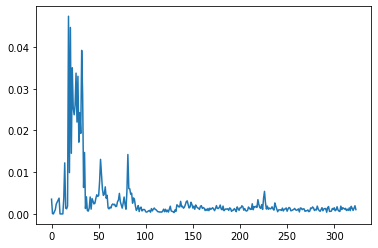

With a lot of stuff from Konstantinos Barmpas' [notebook](https://github.com/KonstantinosBarmpas/Advanced-Machine-Learning-Projects/blob/master/Task%203/Task%203_AML.ipynb).

### TASK 3: HEART RHYTHM CLASSIFICATION FROM RAW ECG SIGNALS

While the previous projects dealt with medical image features, we turn now to the classification of entire time series into one of 4 classes. This time you will work with the original ECG recordings of different length sampled as 300Hz to predict heart rhythm.


```python
# import libraries
import biosppy
import os
import pywt
import statistics
import scipy.stats
import sklearn.preprocessing
import pandas as pd
import numpy as np
import tensorflow as tf
from matplotlib import pyplot as plt
```


```python
# load the data
X_train_df = pd.read_csv('./data/X_train.csv')
X_test_df = pd.read_csv('./data/X_test.csv')
y_train_df = pd.read_csv('./data/y_train.csv')
```

    /Users/lau/opt/anaconda3/envs/latentspace/lib/python3.6/site-packages/IPython/core/interactiveshell.py:3063: DtypeWarning: Columns (17979) have mixed types.Specify dtype option on import or set low_memory=False.
      interactivity=interactivity, compiler=compiler, result=result)


### Preprocessing


```python
# copy data
train_features = X_train_df.copy()
test_features = X_test_df.copy()
train_labels = y_train_df.copy()

# merge labels to dataframe
train_features['y'] = train_labels['y']

# drop 'id' column
train_features = train_features.drop(['id'], axis=1)
test_features = test_features.drop(['id'], axis=1)

# drop random strings
train_features = train_features.replace(r'\\n', np.nan, regex=True)
test_features = test_features.replace(r'\\n', np.nan, regex=True)

# assign label vector
train_labels = train_features['y']

# make arrays out of the dataframes
X_training = np.array(train_features)
X_testing = np.array(test_features)
y_training = np.array(train_labels)

print(X_training.shape, y_training.shape, X_testing.shape)
```

    (5117, 17980) (5117,) (3411, 17979)


### Feature extraction


```python
def load_features(data): # data of type numpy array
    #-------------------------------------------------
    # FFT, power, average and autocorrelation
    autocorr = list()
    ptp = list()
    avg = list()
    fft = list()

    for i in range(len(data)):

        h = data[i]
        h = h[~np.isnan(h)]

        h_series = pd.Series(h)
        corr = h_series.autocorr(lag=2)
        autocorr.append(corr)

        avg.append(np.average(h))
        ptp.append(np.ptp(h))

        f = np.fft.fft(h)
        array = f[0:800]
        n = 20
        indices = array.argsort()[-n:][::-1]
        fft.append(indices)

    new_autocorr = np.transpose(np.array([autocorr]))
    ptp = np.transpose(np.array([ptp]))
    avg = np.transpose(np.array([avg]))
    fft_np = np.array(fft)
    print('autocorrelation.. done')
    print('power.. done')
    print('average.. done')
    print('fourier transform.. done')
    #-------------------------------------------------
    # pad the sequences with 0
    data_pad = np.nan_to_num(data, nan=0.0)
    print('padding sequences.. done')
    #-------------------------------------------------
    # extract using biosppy
    sr = 300 

    ts_list = list()
    filtered_list = list()
    rpeaks_list = list()
    templates_ts_list = list()
    templates_list = list()
    heart_rate_ts_list = list()
    heart_rate_list = list()

    for i in range(len(data_pad)):
        sample = data_pad[i]
        ts, filtered, rpeaks, templates_ts, templates, heart_rate_ts, heart_rate = biosppy.signals.ecg.ecg(
            signal=sample, sampling_rate=sr, show=False)
        ts_list.append(ts)
        filtered_list.append(filtered)
        rpeaks_list.append(rpeaks)
        templates_ts_list.append(templates_ts)
        templates_list.append(templates)
        heart_rate_ts_list.append(heart_rate_ts)
        heart_rate_list.append(heart_rate)
    print('biosppy analysis.. done')
    #-------------------------------------------------
    # Normalize the data and find the average characteristic heartbeat of each patient
    normalized_templates = list()
    patients_heartbeats = list()

    for i in range(len(templates_list)):
        normalized_templates.append(sklearn.preprocessing.normalize(templates_list[i]))
        patients_heartbeats.append(sum(normalized_templates[i])/len(normalized_templates[i]))
    print('normalizing heartbeats.. done')
    #-------------------------------------------------
    # Extarct the peaks from characteristic heartbeat
    P_list = list()
    Q_list = list()
    R_list = list()
    S_list = list()
    T_list = list()

    for i in range(len(patients_heartbeats)):

        patient_current = patients_heartbeats[i]

        # Find the peak
        index = np.where(patient_current==max(patient_current))
        R = index[0]

        # First-half
        first_half = patient_current[0:R[0]]
        index = np.where(patient_current==min(first_half[R[0]-30:R[0]]))
        Q = index[0]

        index = np.where(first_half[0:Q[0]]==max(first_half[0:Q[0]]))
        P = index[0]

        #Second half
        second_half = patient_current[R[0]+1:] 
        index = np.where(patient_current==min(second_half[0:30]))
        S = index[0]

        second_half = second_half[S[0]-R[0]+1:]
        index = np.where(patient_current==max(second_half))
        T = index[0] 

        P_list.append(P[0])
        Q_list.append(Q[0])
        R_list.append(R[0])
        S_list.append(S[0])
        T_list.append(T[0])
    print('extracting heartbeat peaks.. done')
    #-------------------------------------------------
    # Intervals and Ratios of peaks
    PR_list = list()
    QRS_list = list()
    ST_list = list()

    for i in range(len(P_list)):
        PR_list.append(R_list[i] - P_list[i])
        QRS_list.append(S_list[i] - Q_list[i])
        ST_list.append(T_list[i] - S_list[i])

    PR_list = np.array(PR_list).reshape(-1, 1)
    QRS_list = np.array(QRS_list).reshape(-1, 1)
    ST_list = np.array(ST_list).reshape(-1, 1)
    P_list = np.array(P_list).reshape(-1, 1)
    R_list = np.array(R_list).reshape(-1, 1)
    S_list = np.array(S_list).reshape(-1, 1)
    T_list = np.array(T_list).reshape(-1, 1)

    QRS_T_list = np.divide(QRS_list, T_list) 
    QRS_P_list = np.divide(QRS_list, P_list) 
    QRS_T_list = np.nan_to_num(QRS_T_list, nan=0.0, posinf=0.0, neginf=0.0)
    QRS_P_list = np.nan_to_num(QRS_P_list, nan=0.0, posinf=0.0, neginf=0.0)
    print('calculating heartbeat ratios.. done')
    #-------------------------------------------------
    # Peaks mean, median, variant, mode and standard deviation
    peaks_mean = list()
    peaks_std = list()
    peaks_median = list()
    peaks_var = list()

    for i in range(len(rpeaks_list)):
        peaks_mean.append(np.mean(rpeaks_list[i]))
        peaks_std.append(np.std(rpeaks_list[i]))
        peaks_median.append(np.median(rpeaks_list[i]))
        peaks_var.append(np.var(rpeaks_list[i]))
    print('describe peaks.. done')
    #-------------------------------------------------
    # Timings of peaks mean, median, variant and standard deviation
    ts_mean = list()
    ts_std = list()
    ts_median = list()
    ts_var = list()

    for i in range(len(ts_list)):
        d = np.diff(ts_list[i])
        ts_mean.append(np.mean(d))
        ts_std.append(np.std(d))
        ts_median.append(np.median(d))
        ts_var.append(np.mean(d) - np.var(d))

    ts_mean = np.nan_to_num(ts_mean, nan=0.0)
    ts_std = np.nan_to_num(ts_std, nan=0.0)
    ts_median = np.nan_to_num(ts_median, nan=0.0)
    ts_var = np.nan_to_num(ts_var, nan=0.0)
    print('describe peak timins.. done')
    #-------------------------------------------------
    # Range, Mean and Median of amplitudes
    max_A = list()
    min_A = list()
    mean_A = list()
    median_A = list()

    for i in range(len(patients_heartbeats)):
        patient_current = patients_heartbeats[i]
        max_A.append(max(patient_current))
        min_A.append(min(patient_current))
        mean_A.append(np.mean(patient_current))
        median_A.append(np.median(patient_current))
    print('describe amplitudes.. done')
    #-------------------------------------------------
    # Heart rates mean, median, variant and standard deviation
    hr_mean = list()
    hr_std = list()
    hr_median = list()
    hr_var = list()

    for i in range(len(heart_rate_list)):
        d = np.diff(heart_rate_list[i])
        hr_mean.append(np.mean(d))
        hr_std.append(np.std(d))
        hr_median.append(np.median(d))
        hr_var.append(np.mean(d) - np.var(d))

    hr_mean = np.nan_to_num(hr_mean, nan=0.0)
    hr_std = np.nan_to_num(hr_std, nan=0.0)
    hr_median = np.nan_to_num(hr_median, nan=0.0)
    hr_var = np.nan_to_num(hr_var, nan=0.0)
    print('describe heart rates.. done')
    #-------------------------------------------------
    # Timings of heart rates mean, median, variant and standard deviation
    hr_ts_mean = list()
    hr_ts_std = list()
    hr_ts_median = list()
    hr_ts_var = list()

    for i in range(len(heart_rate_ts_list)):
        d = np.diff(heart_rate_ts_list[i])
        hr_ts_mean.append(np.mean(d))
        hr_ts_std.append(np.std(d))
        hr_ts_median.append(np.median(d))
        hr_ts_var.append(np.mean(d) - np.var(d))

    hr_ts_mean = np.nan_to_num(hr_ts_mean, nan=0.0)
    hr_ts_std = np.nan_to_num(hr_ts_std, nan=0.0)
    hr_ts_median = np.nan_to_num(hr_ts_median, nan=0.0)
    hr_ts_var = np.nan_to_num(hr_ts_var, nan=0.0)
    print('describe heartrate timings.. done')
    #-------------------------------------------------
    # Peaks differences mean, median, variant, mode and standard deviation
    diff_mean = list()
    diff_std = list()
    diff_median = list()
    diff_var = list()
    #diff_dev = list()

    for i in range(len(rpeaks_list)):
        d = np.diff(rpeaks_list[i])
        diff_mean.append(np.mean(d))
        diff_std.append(np.std(d))
        diff_median.append(np.median(d))
        diff_var.append(np.mean(d) - np.var(d))
        #diff_dev.append(np.mean(d) - statistics.pstdev(d))

    diff_mean=np.nan_to_num(diff_mean, nan=0.0)
    diff_std=np.nan_to_num(diff_std, nan=0.0)
    diff_median=np.nan_to_num(diff_median, nan=0.0)
    diff_var=np.nan_to_num(diff_var, nan=0.0)
    #diff_dev=np.nan_to_num(diff_dev, nan=0.0)
    print('describe peaks differences.. done')
    #-------------------------------------------------
    # db2 coefficients
    cA_list = list()
    cD_list = list()

    for i in range(len(patients_heartbeats)):
        cA, cD = pywt.dwt(patients_heartbeats[i], 'db2', mode='periodic')

        cA_list.append(cA)
        cD_list.append(cD)
    print('db2 coefficients.. done')
    #-------------------------------------------------
    # Energy of the signal
    energy_list = list()

    for i in range(len(patients_heartbeats)):
        energy_list.append(np.sum(patients_heartbeats[i] ** 2))
    print('energy.. done')
    #-------------------------------------------------
    # collecting list-features
    collect_feature_lists = [P_list, Q_list, R_list, S_list, T_list, peaks_mean, peaks_std,
                             peaks_median, peaks_var, ts_mean, ts_std, ts_median, ts_var,
                             max_A, min_A, mean_A, median_A, hr_mean, hr_std, hr_median,
                             hr_var, hr_ts_mean, hr_ts_std, hr_ts_median, hr_ts_var, 
                             hr_ts_mean, hr_ts_std, hr_ts_median, hr_ts_var, diff_mean,
                             diff_std, diff_median, diff_var, energy_list, new_autocorr, 
                             ptp, avg]
    #-------------------------------------------------
    # collecting array-features
    collect_feature_arrays = [PR_list, QRS_list, ST_list, QRS_T_list, QRS_P_list, cA_list, cD_list, fft_np]
    print('collecting.. done')
    #-------------------------------------------------
    # reshape list-features into arrays and append array-features
    reshaped_features = list()
    for i in range(len(collect_feature_lists)):
        reshaped_features.append(np.array(collect_feature_lists[i]).reshape(-1, 1))

    for i in range(len(collect_feature_arrays)):
        reshaped_features.append(collect_feature_arrays[i])
    print('reshaping.. done')
    #-------------------------------------------------
    # concatenate all features
    X = np.concatenate(reshaped_features, axis=1)
    print('concatenating.. done')
    print('data shape : ', X.shape)
    print('')
    #-------------------------------------------------
    return X
```


```python
X_train = load_features(X_training)
X_test = load_features(X_testing)
```

    autocorrelation.. done
    power.. done
    average.. done
    fourier transform.. done
    padding sequences.. done
    biosppy analysis.. done
    normalizing heartbeats.. done
    extracting heartbeat peaks.. done
    calculating heartbeat ratios.. done


    /Users/lau/opt/anaconda3/envs/latentspace/lib/python3.6/site-packages/ipykernel_launcher.py:131: RuntimeWarning: divide by zero encountered in true_divide


    describe peaks.. done
    describe peak timins.. done
    describe amplitudes.. done


    /Users/lau/opt/anaconda3/envs/latentspace/lib/python3.6/site-packages/numpy/core/fromnumeric.py:3335: RuntimeWarning: Mean of empty slice.
      out=out, **kwargs)
    /Users/lau/opt/anaconda3/envs/latentspace/lib/python3.6/site-packages/numpy/core/_methods.py:161: RuntimeWarning: invalid value encountered in double_scalars
      ret = ret.dtype.type(ret / rcount)
    /Users/lau/opt/anaconda3/envs/latentspace/lib/python3.6/site-packages/numpy/core/_methods.py:217: RuntimeWarning: Degrees of freedom <= 0 for slice
      keepdims=keepdims)
    /Users/lau/opt/anaconda3/envs/latentspace/lib/python3.6/site-packages/numpy/core/_methods.py:186: RuntimeWarning: invalid value encountered in true_divide
      arrmean, rcount, out=arrmean, casting='unsafe', subok=False)
    /Users/lau/opt/anaconda3/envs/latentspace/lib/python3.6/site-packages/numpy/core/_methods.py:209: RuntimeWarning: invalid value encountered in double_scalars
      ret = ret.dtype.type(ret / rcount)
    /Users/lau/opt/anaconda3/envs/latentspace/lib/python3.6/site-packages/numpy/core/fromnumeric.py:3584: RuntimeWarning: Degrees of freedom <= 0 for slice
      **kwargs)


    describe heart rates.. done
    describe heartrate timings.. done
    describe peaks differences.. done
    db2 coefficients.. done
    energy.. done
    collecting.. done
    reshaping.. done
    concatenating.. done
    data shape :  (5117, 244)
    
    autocorrelation.. done
    power.. done
    average.. done
    fourier transform.. done
    padding sequences.. done
    biosppy analysis.. done
    normalizing heartbeats.. done
    extracting heartbeat peaks.. done


    /Users/lau/opt/anaconda3/envs/latentspace/lib/python3.6/site-packages/ipykernel_launcher.py:131: RuntimeWarning: divide by zero encountered in true_divide


    calculating heartbeat ratios.. done
    describe peaks.. done
    describe peak timins.. done
    describe amplitudes.. done


    /Users/lau/opt/anaconda3/envs/latentspace/lib/python3.6/site-packages/numpy/core/fromnumeric.py:3335: RuntimeWarning: Mean of empty slice.
      out=out, **kwargs)
    /Users/lau/opt/anaconda3/envs/latentspace/lib/python3.6/site-packages/numpy/core/_methods.py:161: RuntimeWarning: invalid value encountered in double_scalars
      ret = ret.dtype.type(ret / rcount)
    /Users/lau/opt/anaconda3/envs/latentspace/lib/python3.6/site-packages/numpy/core/_methods.py:217: RuntimeWarning: Degrees of freedom <= 0 for slice
      keepdims=keepdims)
    /Users/lau/opt/anaconda3/envs/latentspace/lib/python3.6/site-packages/numpy/core/_methods.py:186: RuntimeWarning: invalid value encountered in true_divide
      arrmean, rcount, out=arrmean, casting='unsafe', subok=False)
    /Users/lau/opt/anaconda3/envs/latentspace/lib/python3.6/site-packages/numpy/core/_methods.py:209: RuntimeWarning: invalid value encountered in double_scalars
      ret = ret.dtype.type(ret / rcount)
    /Users/lau/opt/anaconda3/envs/latentspace/lib/python3.6/site-packages/numpy/core/fromnumeric.py:3584: RuntimeWarning: Degrees of freedom <= 0 for slice
      **kwargs)


    describe heart rates.. done
    describe heartrate timings.. done
    describe peaks differences.. done
    db2 coefficients.. done
    energy.. done
    collecting.. done
    reshaping.. done
    concatenating.. done
    data shape :  (3411, 244)
    


### Training preparation


```python
from sklearn.preprocessing import StandardScaler
```


```python
scaler = StandardScaler()
X_train_scaled = scaler.fit_transform(X_train, y_train)
X_test_scaler = scaler.transform(X_test)
```

### Training


```python
from sklearn.ensemble import GradientBoostingClassifier
from sklearn.model_selection import cross_val_score
```


```python
seed = 23
estimator = GradientBoostingClassifier(learning_rate=0.05, n_estimators=500, max_depth=10,
                                       min_samples_split=40, min_samples_leaf=4, max_features='sqrt',
                                       random_state=seed)
cross_validation = cross_val_score(estimator, X_train, y_training, cv=5, n_jobs=-1, scoring='f1_micro')
```


```python
print("f1: %0.4f (+/- %0.4f)" % (cross_validation.mean(), cross_validation.std() * 2))
```

    f1: 0.8079 (+/- 0.0236)


### Feature importance analysis


```python
training = estimator.fit(X_train, y_training)
```


```python
best_params = training.feature_importances_
plt.plot(best_params)
```


    [<matplotlib.lines.Line2D at 0x7fd69961eb00>]


    

    


### Predict on test set


```python
estimator.fit(X_train, y_training)
```


    GradientBoostingClassifier(learning_rate=0.05, max_depth=10,
                               max_features='sqrt', min_samples_leaf=4,
                               min_samples_split=40, n_estimators=500,
                               random_state=23)


```python
prediction = estimator.predict(X_test)
```


```python
ID = np.array(range(len(prediction)))
df = pd.DataFrame({'id': ID,
                    'y': prediction})
name = '03_standard_scaled.csv'
path = os.path.join('.', name)
df.to_csv(path, index=False)
```

### Result

| F-measure (micro) | |
:- | :-
hard baseline | 0.82
public test set | 0.8147
private test set | 0.8259


```python

```
