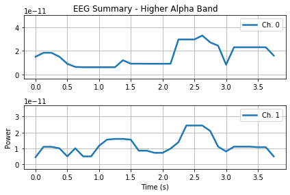

### TASK 4: SLEEP STAGING FROM EEG/EMG

In this task we will perform sequence classification. We will categorize temporally coherent and uniformly distributed short sections of a long time-series. In particular, for each 4 seconds of a lengthy EEG/EMG measurement of brain activity recorded during sleep, we will assign one of the 3 classes corresponding to the sleep stage present within the evaluated epoch.

The training targets (sleep stages) take the values from {1: "WAKE phase", 2: "NREM phase", 3: "REM phase"}.


```python
# import libraries
import biosppy
import biosppy.signals.eeg as eeg
import biosppy.signals.emg as emg
import pywt
import statistics
import scipy.stats
import sklearn.preprocessing
import pandas as pd
import numpy as np
import os, glob
import tensorflow as tf
from matplotlib import pyplot as plt
from sklearn.feature_selection import SelectKBest, chi2, f_regression
from sklearn.metrics import plot_confusion_matrix
from sklearn import preprocessing
from sklearn.preprocessing import normalize
```


```python
# load the data
train_eeg1_df = pd.read_csv('./data/train_eeg1.csv')
train_eeg2_df = pd.read_csv('./data/train_eeg2.csv')
train_emg_df = pd.read_csv('./data/train_emg.csv')

test_eeg1_df = pd.read_csv('./data/test_eeg1.csv')
test_eeg2_df = pd.read_csv('./data/test_eeg2.csv')
test_emg_df = pd.read_csv('./data/test_emg.csv')

train_labels_df = pd.read_csv('./data/train_labels.csv')
```


```python
train_eeg1_df
```


<div>
<style scoped>
    .dataframe tbody tr th:only-of-type {
        vertical-align: middle;
    }

    .dataframe tbody tr th {
        vertical-align: top;
    }

    .dataframe thead th {
        text-align: right;
    }
</style>
<table border="1" class="dataframe">
  <thead>
    <tr style="text-align: right;">
      <th></th>
      <th>Id</th>
      <th>x1</th>
      <th>x2</th>
      <th>x3</th>
      <th>x4</th>
      <th>x5</th>
      <th>x6</th>
      <th>x7</th>
      <th>x8</th>
      <th>x9</th>
      <th>...</th>
      <th>x503</th>
      <th>x504</th>
      <th>x505</th>
      <th>x506</th>
      <th>x507</th>
      <th>x508</th>
      <th>x509</th>
      <th>x510</th>
      <th>x511</th>
      <th>x512</th>
    </tr>
  </thead>
  <tbody>
    <tr>
      <th>0</th>
      <td>0</td>
      <td>0.000400</td>
      <td>0.000470</td>
      <td>0.000067</td>
      <td>-0.000160</td>
      <td>-0.000003</td>
      <td>0.000310</td>
      <td>0.000360</td>
      <td>0.000190</td>
      <td>-0.000072</td>
      <td>...</td>
      <td>-0.000086</td>
      <td>0.000033</td>
      <td>-0.000046</td>
      <td>-0.000270</td>
      <td>-0.000390</td>
      <td>-0.000340</td>
      <td>-0.000320</td>
      <td>-0.00021</td>
      <td>0.000042</td>
      <td>0.000053</td>
    </tr>
    <tr>
      <th>1</th>
      <td>1</td>
      <td>0.000067</td>
      <td>0.000095</td>
      <td>0.000270</td>
      <td>0.000280</td>
      <td>0.000250</td>
      <td>0.000120</td>
      <td>0.000094</td>
      <td>-0.000340</td>
      <td>-0.000960</td>
      <td>...</td>
      <td>0.000046</td>
      <td>0.000300</td>
      <td>0.000630</td>
      <td>0.000710</td>
      <td>0.000520</td>
      <td>0.000410</td>
      <td>0.000660</td>
      <td>0.00088</td>
      <td>0.000770</td>
      <td>0.000410</td>
    </tr>
    <tr>
      <th>2</th>
      <td>2</td>
      <td>0.000160</td>
      <td>-0.000210</td>
      <td>-0.000840</td>
      <td>-0.001200</td>
      <td>-0.001200</td>
      <td>-0.001400</td>
      <td>-0.001400</td>
      <td>-0.000910</td>
      <td>-0.000600</td>
      <td>...</td>
      <td>-0.000680</td>
      <td>-0.000880</td>
      <td>-0.001000</td>
      <td>-0.000770</td>
      <td>-0.000680</td>
      <td>-0.000730</td>
      <td>-0.000730</td>
      <td>-0.00062</td>
      <td>-0.000550</td>
      <td>-0.000540</td>
    </tr>
    <tr>
      <th>3</th>
      <td>3</td>
      <td>-0.000140</td>
      <td>0.000260</td>
      <td>0.000390</td>
      <td>0.000430</td>
      <td>0.000280</td>
      <td>0.000230</td>
      <td>0.000390</td>
      <td>0.000220</td>
      <td>0.000150</td>
      <td>...</td>
      <td>0.000720</td>
      <td>0.000760</td>
      <td>0.000380</td>
      <td>0.000052</td>
      <td>-0.000260</td>
      <td>-0.000580</td>
      <td>-0.000750</td>
      <td>-0.00110</td>
      <td>-0.001200</td>
      <td>-0.001200</td>
    </tr>
    <tr>
      <th>4</th>
      <td>4</td>
      <td>-0.001100</td>
      <td>-0.000790</td>
      <td>-0.000081</td>
      <td>0.000140</td>
      <td>0.000200</td>
      <td>-0.000140</td>
      <td>-0.000430</td>
      <td>-0.000530</td>
      <td>-0.000580</td>
      <td>...</td>
      <td>0.000290</td>
      <td>0.000600</td>
      <td>0.000670</td>
      <td>0.000190</td>
      <td>-0.000055</td>
      <td>-0.000160</td>
      <td>-0.000230</td>
      <td>-0.00023</td>
      <td>-0.000330</td>
      <td>-0.000810</td>
    </tr>
    <tr>
      <th>...</th>
      <td>...</td>
      <td>...</td>
      <td>...</td>
      <td>...</td>
      <td>...</td>
      <td>...</td>
      <td>...</td>
      <td>...</td>
      <td>...</td>
      <td>...</td>
      <td>...</td>
      <td>...</td>
      <td>...</td>
      <td>...</td>
      <td>...</td>
      <td>...</td>
      <td>...</td>
      <td>...</td>
      <td>...</td>
      <td>...</td>
      <td>...</td>
    </tr>
    <tr>
      <th>64795</th>
      <td>64795</td>
      <td>-0.000650</td>
      <td>-0.000300</td>
      <td>-0.000019</td>
      <td>0.000390</td>
      <td>0.000260</td>
      <td>0.000083</td>
      <td>0.000180</td>
      <td>0.000480</td>
      <td>0.000430</td>
      <td>...</td>
      <td>0.000310</td>
      <td>0.000660</td>
      <td>0.000310</td>
      <td>0.000320</td>
      <td>0.000038</td>
      <td>-0.000099</td>
      <td>-0.000130</td>
      <td>-0.00051</td>
      <td>-0.000530</td>
      <td>-0.000370</td>
    </tr>
    <tr>
      <th>64796</th>
      <td>64796</td>
      <td>-0.000350</td>
      <td>0.000026</td>
      <td>0.000044</td>
      <td>-0.000026</td>
      <td>-0.000230</td>
      <td>0.000080</td>
      <td>0.000095</td>
      <td>0.000067</td>
      <td>0.000200</td>
      <td>...</td>
      <td>-0.000330</td>
      <td>-0.000460</td>
      <td>-0.000660</td>
      <td>-0.000630</td>
      <td>-0.000710</td>
      <td>-0.000580</td>
      <td>-0.000720</td>
      <td>-0.00058</td>
      <td>-0.000530</td>
      <td>-0.000320</td>
    </tr>
    <tr>
      <th>64797</th>
      <td>64797</td>
      <td>-0.000210</td>
      <td>-0.000070</td>
      <td>-0.000030</td>
      <td>0.000100</td>
      <td>0.000180</td>
      <td>-0.000081</td>
      <td>-0.000350</td>
      <td>-0.000520</td>
      <td>-0.000400</td>
      <td>...</td>
      <td>0.000074</td>
      <td>-0.000120</td>
      <td>0.000010</td>
      <td>0.000130</td>
      <td>-0.000150</td>
      <td>-0.000230</td>
      <td>-0.000019</td>
      <td>-0.00018</td>
      <td>0.000014</td>
      <td>0.000260</td>
    </tr>
    <tr>
      <th>64798</th>
      <td>64798</td>
      <td>0.000080</td>
      <td>0.000280</td>
      <td>0.000075</td>
      <td>0.000330</td>
      <td>0.000310</td>
      <td>-0.000012</td>
      <td>-0.000170</td>
      <td>-0.000270</td>
      <td>-0.000230</td>
      <td>...</td>
      <td>-0.000610</td>
      <td>-0.000420</td>
      <td>-0.000310</td>
      <td>-0.000340</td>
      <td>-0.000420</td>
      <td>-0.000060</td>
      <td>0.000082</td>
      <td>0.00026</td>
      <td>0.000130</td>
      <td>0.000170</td>
    </tr>
    <tr>
      <th>64799</th>
      <td>64799</td>
      <td>0.000080</td>
      <td>0.000280</td>
      <td>0.000075</td>
      <td>0.000330</td>
      <td>0.000310</td>
      <td>-0.000012</td>
      <td>-0.000170</td>
      <td>-0.000270</td>
      <td>-0.000230</td>
      <td>...</td>
      <td>-0.000610</td>
      <td>-0.000420</td>
      <td>-0.000310</td>
      <td>-0.000340</td>
      <td>-0.000420</td>
      <td>-0.000060</td>
      <td>0.000082</td>
      <td>0.00026</td>
      <td>0.000130</td>
      <td>0.000170</td>
    </tr>
  </tbody>
</table>
<p>64800 rows × 513 columns</p>
</div>


### Preprocessing


```python
# copy data
train_eeg1 = train_eeg1_df.copy()
train_eeg2 = train_eeg2_df.copy()
train_emg = train_emg_df.copy()

# merge labels to dataframe (for plotting)
train_eeg1['y'] = train_labels_df['y']
train_eeg2['y'] = train_labels_df['y']
train_emg['y'] = train_labels_df['y']

# drop 'id' column
train_eeg1 = train_eeg1.drop(['Id'], axis=1)
train_eeg2 = train_eeg2.drop(['Id'], axis=1)
train_emg = train_emg.drop(['Id'], axis=1)

# assign label vector
y_train = train_labels_df['y']

# make arrays out of the dataframes
#X_training = np.array(train_features)
#X_testing = np.array(test_features)
#y_training = np.array(train_labels)

#print(train_eeg1.shape, train_eeg2.shape, train_emg.shape)
print(y_train.shape[0], 'samples')
```

    64800 samples


```python
# check the distribution of each class
label_names = ['awake', 'non-rem', 'rem']
labels, counts = np.unique(y_train, return_counts=True)
for i in range(len(labels)):
    print('class {}: {} - {}'.format(labels[i], counts[i], label_names[i]))
```

    class 1: 34114 - awake
    class 2: 27133 - non-rem
    class 3: 3553 - rem


```python
# plot some examples 
def plot_examples(cl, df, all_classes=False):
    rand = np.random.randint(150, size=5)
    fig, ax = plt.subplots(len(rand), figsize=(15,12), constrained_layout=True)
    if all_classes == True:
        for i in range(len(rand)):
            for lab in labels:
                df.loc[df['y'] == lab].iloc[rand[i], :-1].plot(ax=ax[i], label='class {}'.format(lab))
            ax[i].set(title='Sample {}'.format(rand[i]))
            ax[i].legend(loc='upper left')
        return
    else:
        for i in range(len(rand)):
            df.loc[df['y'] == cl].iloc[rand[i], :-1].plot(ax=ax[i], label='class {}'.format(cl))
            ax[i].set(title='Sample {}'.format(rand[i]))
            ax[i].legend(loc='upper left')
        return
```


```python
plot_examples(1, train_eeg2, False) # choose class or choose to show all classes (chosen class is ignored) 
```


```python
# drop label from the training dataframes
train_eeg1 = train_eeg1.drop(columns='y')
train_eeg2 = train_eeg2.drop(columns='y')
train_emg = train_emg.drop(columns='y')

# convert to array
train_eeg1 = train_eeg1.to_numpy()
train_eeg2 = train_eeg2.to_numpy()
train_emg = train_emg.to_numpy()

test_eeg1 = test_eeg1.to_numpy()
test_eeg2 = test_eeg2.to_numpy()
test_emg = test_emg.to_numpy()

# normalize 
train_eeg1 = normalize(train_eeg1)
train_eeg2 = normalize(train_eeg2)
train_emg = normalize(train_emg)

test_eeg1 = normalize(test_eeg1)
test_eeg2 = normalize(test_eeg2)
test_emg = normalize(test_emg)

print(train_eeg1.shape, train_eeg2.shape, train_emg.shape)
print(test_eeg1.shape, test_eeg2.shape, test_emg.shape)
print(y_train.shape)
```

    (64800, 512) (64800, 512) (64800, 512)
    (64800,)


### Feature Extraction


```python
signal_array = np.column_stack((train_eeg1[0], train_eeg2[0]))
ts, filtered, features_ts, theta, alpha_low, alpha_high, beta, gamma, plf_pairs, plf = biosppy.signals.eeg.eeg(signal_array, sampling_rate=128, show=True)
```





```python
# lowpass- / highpassfilter functions for emg analysis
from scipy.signal import butter, lfilter, freqz

def butter_lowpass(cutoff, fs, order=5):
    nyq = 0.5 * fs
    normal_cutoff = cutoff / nyq
    b, a = butter(order, normal_cutoff, btype='low', analog=False)
    return b, a

def butter_lowpass_filter(data, cutoff, fs, order):
    b, a = butter_lowpass(cutoff, fs, order=order)
    y = lfilter(b, a, data)
    return y

def butter_highpass(cutoff, fs, order=5):
    nyq = 0.5 * fs
    normal_cutoff = cutoff / nyq
    b, a = butter(order, normal_cutoff, btype='high', analog=False)
    return b, a

def butter_highpass_filter(data, cutoff, fs, order):
    b, a = butter_highpass(cutoff, fs, order=order)
    y = lfilter(b, a, data)
    return y
```


```python
# extract EEG and EMG features

def extract_features(eeg1_data, eeg2_data, emg_data):
    
    # --------------------------------------------------
    # extract EEG signal features with biosppy
    # --------------------------------------------------
    
    ts_list = []
    filtered_list = []
    features_ts_list = []
    theta_list = []
    alpha_low_list = []
    alpha_high_list = []
    beta_list = []
    gamma_list = []
    plf_pairs_list = []
    plf_list = []

    for sample1, sample2 in zip(eeg1_data, eeg2_data):
        joint = np.column_stack((sample1, sample2))
        ts, filtered, features_ts, theta, alpha_low, alpha_high, beta, gamma, plf_pairs, plf = eeg.eeg(joint, sampling_rate=128, show=False)
        ts_list.append(ts)
        filtered_list.append(filtered)
        features_ts_list.append(features_ts)
        theta_list.append(theta)
        alpha_low_list.append(alpha_low)
        alpha_high_list.append(alpha_high)
        beta_list.append(beta)
        gamma_list.append(gamma)
        plf_pairs_list.append(plf_pairs)
        plf_list.append(plf)
    
    # --------------------------------------------------
    # extract EEG stats from features
    # --------------------------------------------------
    
    feat_list = [theta_list, alpha_low_list, alpha_high_list, beta_list, gamma_list, plf_list]
    theta_mean_list = []
    theta_std_list = []
    theta_var_list = []
    theta_range_list = []
    theta_energy_list = []
    alpha_low_mean_list = []
    alpha_low_std_list = []
    alpha_low_var_list = []
    alpha_low_range_list = []
    alpha_low_energy_list = []
    alpha_high_mean_list = []
    alpha_high_std_list = []
    alpha_high_var_list = []
    alpha_high_range_list = []
    alpha_high_energy_list = []
    beta_mean_list = []
    beta_std_list = []
    beta_var_list = []
    beta_range_list = []
    beta_energy_list = []
    gamma_mean_list = []
    gamma_std_list = []
    gamma_var_list = []
    gamma_range_list = []
    gamma_energy_list = []
    plf_mean_list = []
    plf_std_list = []
    plf_var_list = []
    plf_range_list = []
    plf_energy_list = []

    total_energies_list=[]
    for i in range(len(theta_list)):
        total_energies_list.append(np.sum(theta_list[i]** 2)+np.sum(alpha_low_list[i]** 2)+
                                 np.sum(alpha_high_list[i]** 2)+np.sum(alpha_high_list[i]** 2)+
                                 np.sum(gamma_list[i]** 2))

    for i in range(len(feat_list)):
        for j in feat_list[i]:
            if i == 0:
                theta_mean_list.append(np.mean(j))
                theta_std_list.append(np.std(j))
                theta_var_list.append(np.var(j))
                theta_range_list.append(np.ptp(j))
                theta_energy_list.append(np.sum(j** 2))
            if i == 1:
                alpha_low_mean_list.append(np.mean(j))
                alpha_low_std_list.append(np.std(j))
                alpha_low_var_list.append(np.var(j))
                alpha_low_range_list.append(np.ptp(j))
                alpha_low_energy_list.append(np.sum(j** 2))
            if i == 2:
                alpha_high_mean_list.append(np.mean(j))
                alpha_high_std_list.append(np.std(j))
                alpha_high_var_list.append(np.var(j))
                alpha_high_range_list.append(np.ptp(j))
                alpha_high_energy_list.append(np.sum(j** 2))
            if i == 3:
                beta_mean_list.append(np.mean(j))
                beta_std_list.append(np.std(j))
                beta_var_list.append(np.var(j))
                beta_range_list.append(np.ptp(j))
                beta_energy_list.append(np.sum(j** 2))
            if i == 4:
                gamma_mean_list.append(np.mean(j))
                gamma_std_list.append(np.std(j))
                gamma_var_list.append(np.var(j))
                gamma_range_list.append(np.ptp(j))
                gamma_energy_list.append(np.sum(j** 2))
            elif i == 5:
                plf_mean_list.append(np.mean(j))
                plf_std_list.append(np.std(j))
                plf_var_list.append(np.var(j))
                plf_range_list.append(np.ptp(j))
                plf_energy_list.append(np.sum(j** 2))
                
    # ratios std
    theta_energy_list_std = np.divide(theta_std_list, total_energies_list)
    alpha_low_energy_list_std = np.divide(alpha_low_std_list, total_energies_list)
    alpha_high_energy_list_std = np.divide(alpha_high_std_list, total_energies_list)
    beta_energy_list_std = np.divide(beta_std_list, total_energies_list)
    gamma_energy_list_std = np.divide(gamma_std_list, total_energies_list)
    plf_energy_list_std = np.divide(plf_std_list, total_energies_list)
    # ratios mean
    theta_energy_list_mean = np.divide(theta_mean_list, total_energies_list)
    alpha_low_energy_list_mean = np.divide(alpha_low_mean_list, total_energies_list)
    alpha_high_energy_list_mean = np.divide(alpha_high_mean_list, total_energies_list)
    beta_energy_list_mean = np.divide(beta_mean_list, total_energies_list)
    gamma_energy_list_mean = np.divide(gamma_mean_list, total_energies_list)
    plf_energy_list_mean = np.divide(plf_mean_list, total_energies_list)
    
    
    # --------------------------------------------------
    # extract EMG signal features
    # --------------------------------------------------
    
    fs = 128
    cutoff_lp = 5
    order_lp = 6
    cutoff_hp = 60
    order_hp = 6

    max_peak_lp_list = []
    max_peak_hp_list = []
    min_peak_lp_list = []
    min_peak_hp_list = []
    number_peaks_lp_list = []
    number_peaks_hp_list = []
    mean_lp_list = []
    mean_hp_list = []
    std_lp_list = []
    std_hp_list = []

    for i in emg_data:
        y1 = butter_lowpass_filter(i, cutoff_lp, fs, order_lp)
        y2 = butter_highpass_filter(i, cutoff_hp, fs, order_hp)
        y2 = abs(y2)
        max_peak_lp = np.where(y1==max(y1))
        max_peak_hp = np.where(y2==max(y2))
        min_peak_lp = np.where(y1==min(y1))
        min_peak_hp = np.where(y2==min(y2))
        peaks_lp = scipy.signal.find_peaks(y1)
        peaks_hp = scipy.signal.find_peaks(y2)
        mean_lp = np.mean(y1)
        mean_hp = np.mean(y2)
        std_lp = np.std(y1)
        std_hp = np.std(y2)
        number_peaks_lp = len(peaks_lp[0])
        number_peaks_hp = len(peaks_hp[0])
        max_peak_lp_list.append(max_peak_lp[0][0])
        max_peak_hp_list.append(max_peak_hp[0][0])
        min_peak_lp_list.append(min_peak_lp[0][0])
        min_peak_hp_list.append(min_peak_hp[0][0])
        number_peaks_lp_list.append(number_peaks_lp)
        number_peaks_hp_list.append(number_peaks_hp)
        mean_lp_list.append(mean_lp)
        mean_hp_list.append(mean_hp)
        std_lp_list.append(std_lp)
        std_hp_list.append(std_hp)
    
    
    # --------------------------------------------------
    # merge all features to a dataframe
    # --------------------------------------------------
    
    theta_mean_arr = np.array(theta_mean_list).reshape(-1,1)
    theta_std_arr = np.array(theta_std_list).reshape(-1,1)
    theta_var_arr = np.array(theta_var_list).reshape(-1,1)
    theta_range_arr = np.array(theta_range_list).reshape(-1,1)
    theta_energy_arr = np.array(theta_energy_list).reshape(-1,1)
    alpha_low_mean_arr = np.array(alpha_low_mean_list).reshape(-1,1)
    alpha_low_std_arr = np.array(alpha_low_std_list).reshape(-1,1)
    alpha_low_var_arr = np.array(alpha_low_var_list).reshape(-1,1)
    alpha_low_range_arr = np.array(alpha_low_range_list).reshape(-1,1)
    alpha_low_energy_arr = np.array(alpha_low_energy_list).reshape(-1,1)
    alpha_high_mean_arr = np.array(alpha_high_mean_list).reshape(-1,1)
    alpha_high_std_arr = np.array(alpha_high_std_list).reshape(-1,1)
    alpha_high_var_arr = np.array(alpha_high_var_list).reshape(-1,1)
    alpha_high_range_arr = np.array(alpha_high_range_list).reshape(-1,1)
    alpha_high_energy_arr = np.array(alpha_high_energy_list).reshape(-1,1)
    beta_mean_arr = np.array(beta_mean_list).reshape(-1,1)
    beta_std_arr = np.array(beta_std_list).reshape(-1,1)
    beta_var_arr = np.array(beta_var_list).reshape(-1,1)
    beta_range_arr = np.array(beta_range_list).reshape(-1,1)
    beta_energy_arr = np.array(beta_energy_list).reshape(-1,1)
    gamma_mean_arr = np.array(gamma_mean_list).reshape(-1,1)
    gamma_std_arr = np.array(gamma_std_list).reshape(-1,1)
    gamma_var_arr = np.array(gamma_var_list).reshape(-1,1)
    gamma_range_arr = np.array(gamma_range_list).reshape(-1,1)
    gamma_energy_arr = np.array(gamma_energy_list).reshape(-1,1)
    plf_mean_arr = np.array(plf_mean_list).reshape(-1,1)
    plf_std_arr = np.array(plf_std_list).reshape(-1,1)
    plf_var_arr = np.array(plf_var_list).reshape(-1,1)
    plf_range_arr = np.array(plf_range_list ).reshape(-1,1)
    plf_energy_arr = np.array(plf_energy_list).reshape(-1,1)
    theta_energy_arr_std = np.array(theta_energy_list_std).reshape(-1,1)
    alpha_low_energy_arr_std = np.array(alpha_low_energy_list_std).reshape(-1,1)
    alpha_high_energy_arr_std = np.array(alpha_high_energy_list_std).reshape(-1,1)
    beta_energy_arr_std = np.array(beta_energy_list_std).reshape(-1,1)
    gamma_energy_arr_std = np.array(gamma_energy_list_std).reshape(-1,1)
    plf_energy_arr_std = np.array(plf_energy_list_std).reshape(-1,1)
    theta_energy_arr_mean = np.array(theta_energy_list_mean).reshape(-1,1)
    alpha_low_energy_arr_mean = np.array(alpha_low_energy_list_mean).reshape(-1,1)
    alpha_high_energy_arr_mean = np.array(alpha_high_energy_list_mean).reshape(-1,1)
    beta_energy_arr_mean = np.array(beta_energy_list_mean).reshape(-1,1)
    gamma_energy_arr_mean = np.array(gamma_energy_list_mean).reshape(-1,1)
    plf_energy_arr_mean = np.array(plf_energy_list_mean).reshape(-1,1)
    max_peak_lp_arr = np.array(max_peak_lp_list).reshape(-1,1)
    max_peak_hp_arr = np.array(max_peak_hp_list).reshape(-1,1)
    min_peak_lp_arr = np.array(min_peak_lp_list).reshape(-1,1)
    min_peak_hp_arr = np.array(min_peak_hp_list).reshape(-1,1)
    number_peaks_lp_arr = np.array(number_peaks_lp_list).reshape(-1,1)
    number_peaks_hp_arr = np.array(number_peaks_hp_list).reshape(-1,1)
    mean_lp_arr = np.array(mean_lp_list).reshape(-1,1)
    mean_hp_arr = np.array(mean_hp_list).reshape(-1,1)
    std_lp_arr = np.array(std_lp_list).reshape(-1,1)
    std_hp_arr = np.array(std_hp_list).reshape(-1,1)

    dataframe = np.concatenate((theta_mean_arr, 
        theta_std_arr,
        theta_var_arr, 
        theta_range_arr, 
        theta_energy_arr, 
        alpha_low_mean_arr,
        alpha_low_std_arr, 
        alpha_low_var_arr, 
        alpha_low_range_arr, 
        alpha_low_energy_arr, 
        alpha_high_mean_arr, 
        alpha_high_std_arr, 
        alpha_high_var_arr, 
        alpha_high_range_arr, 
        alpha_high_energy_arr, 
        beta_mean_arr, 
        beta_std_arr, 
        beta_var_arr, 
        beta_range_arr, 
        beta_energy_arr, 
        gamma_mean_arr, 
        gamma_std_arr, 
        gamma_var_arr, 
        gamma_range_arr, 
        gamma_energy_arr, 
        plf_mean_arr, 
        plf_std_arr, 
        plf_var_arr, 
        plf_range_arr, 
        plf_energy_arr, 
        theta_energy_arr_std, 
        alpha_low_energy_arr_std, 
        alpha_high_energy_arr_std,
        beta_energy_arr_std, 
        gamma_energy_arr_std, 
        plf_energy_arr_std, 
        theta_energy_arr_mean, 
        alpha_low_energy_arr_mean, 
        alpha_high_energy_arr_mean,
        beta_energy_arr_mean,
        gamma_energy_arr_mean,
        plf_energy_arr_mean,
        max_peak_lp_arr,
        max_peak_hp_arr,
        min_peak_lp_arr,
        min_peak_hp_arr,
        number_peaks_lp_arr,
        number_peaks_hp_arr,
        mean_lp_arr,
        mean_hp_arr,
        std_lp_arr,
        std_hp_arr), axis=1)       
    
    return dataframe
```


```python
# function calls
X_train = extract_features(train_eeg1, train_eeg2, train_emg)
X_test = extract_features(test_eeg1, test_eeg2, test_emg)
print(X_train.shape, X_test.shape)
print(y_train.shape)
```

    (64800, 52) (43200, 52)


### Feature Selection


```python
# feature selection
def select_features(X, y, X_t, n_features): # use 'all' to consider all features
    # configure to select a subset of features
    fs = SelectKBest(score_func=f_regression, k=n_features)
    # learn relationship from training data
    fs.fit(X, y)
    # transform train input data
    X_fs = fs.transform(X)
    # transform test input data
    X_fs_t = fs.transform(X_t)
    return X_fs, X_fs_t, fs
```


```python
feat_num = 29
# Function call
X_train_fs, X_test_fs, fs = select_features(X_train, y_train, X_test, feat_num)
# what are scores for the features
for i in range(10):
    print('Feature %d: %f' % (i, fs.scores_[i]))
print('')
print(X_train_fs.shape, X_test_fs.shape)
```

    Feature 0: 2313.722496
    Feature 1: 855.348264
    Feature 2: 1031.225274
    Feature 3: 912.442367
    Feature 4: 5009.680889
    Feature 5: 24.486981
    Feature 6: 83.535659
    Feature 7: 42.619963
    Feature 8: 15.562658
    Feature 9: 27.010672
    
    (64800, 29) (43200, 29)


### Training preparation


```python
from sklearn.preprocessing import StandardScaler
```


```python
scaler = StandardScaler()
X_train_scaled = scaler.fit_transform(X_train_fs, y_train)
X_test_scaled = scaler.transform(X_test_fs)
```


```python
from sklearn import svm
from sklearn.model_selection import cross_val_score
```


```python
labels, counts = np.unique(y_train, return_counts=True)
for i in range(len(labels)):
    print('class {}: {}'.format(labels[i], counts[i]))
print('')
print('total: {}'.format(y_train.shape[0]))
```

    class 1: 34114
    class 2: 27133
    class 3: 3553
    
    total: 64800


```python
# Scaling by total/2 helps keep the loss to a similar magnitude.
# The sum of the weights of all examples stays the same.
weight_for_1 = (1 / 34114)*(64800)/3.0 
weight_for_2 = (1 / 27133)*(64800)/3.0
weight_for_3 = (1 / 3553)*(64800)/3.0

weights = {1: weight_for_1, 2: weight_for_2, 3: weight_for_3}

print('Weight for class 1: {:.2f}'.format(weight_for_1))
print('Weight for class 2: {:.2f}'.format(weight_for_2))
print('Weight for class 3: {:.2f}'.format(weight_for_3))
```

    Weight for class 1: 0.63
    Weight for class 2: 0.80
    Weight for class 3: 6.08


### Training


```python
seed = 77
estimator = svm.SVC(class_weight=weights,
               random_state=seed,
               kernel='rbf',
               tol=0.001,
               gamma='scale',
               degree=3,
               decision_function_shape='ovo',
               C=0.5)
```


```python
cross_validation = cross_val_score(estimator, X_train_scaled, y_train, cv=5, n_jobs=-1, scoring='balanced_accuracy')
```


```python
print("bmac: %0.4f (+/- %0.4f)" % (cross_validation.mean(), cross_validation.std() * 2))
```

    bmac: 0.9301 (+/- 0.0570)


```python
estimator.fit(X_train_scaled, y_train)
```


    SVC(C=0.5,
        class_weight={1: 0.6331711320865333, 2: 0.796078575903881,
                      3: 6.079369546861806},
        decision_function_shape='ovo', random_state=77)


```python
plot_confusion_matrix(estimator, X_train_scaled, y_train)
```


    <sklearn.metrics._plot.confusion_matrix.ConfusionMatrixDisplay at 0x7ff41b4c41d0>


### Predicting on test set


```python
svc_prediction = estimator.predict(X_test_scaled)
```


```python
ID = np.array(range(len(X_test_scaled)))
df = pd.DataFrame({'Id': ID,
                    'y': svc_prediction})
name = '03svc_fs29.csv'
path = os.path.join('.', name)
df.to_csv(path, index=False)
```

### Result

public BMAC score: **0.914024750101** <br>
private BMAC score: **0.930690685031**


```python

```
